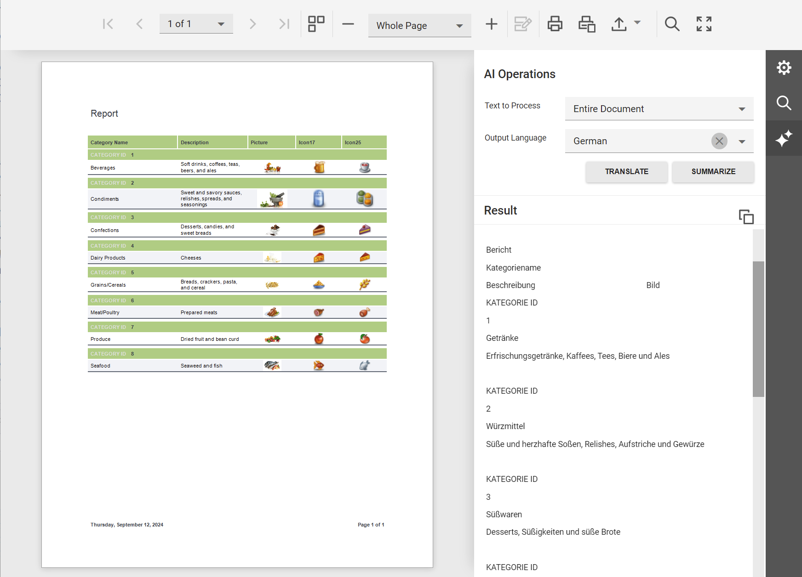

<!-- default badges list -->
[](https://supportcenter.devexpress.com/ticket/details/T1253420)
[](https://docs.devexpress.com/GeneralInformation/403183)
[](#does-this-example-address-your-development-requirementsobjectives)
<!-- default badges end -->
# Reporting for ASP.NET Core - Integrate AI-powered Summarize and Translate Features based on Azure OpenAI

This example adds two new buttons that help users to summarize and translate a report content in the JavaScript Document Viewer with AI-powered functionality:

- **Summarize**: When you click this button, Generative AI summaries generate content that helps you quickly understand/analyze core insights associated with a given report.
- **Translate**: This button helps you translate report documents, chosen pages, or selected content to a desired language with AI-powered translation tools.



## Implementation Details

### Add NuGet Packages

Add the following NuGet packages:
- `DevExpress.AIIntegration.AspNetCore.Reporting`
- `DevExpress.AIIntegration.Azure.OpenAI` or `DevExpress.AIIntegration.OpenAI` based on your AI service preferences.

### Add Personal Keys

You need to create an Azure OpenAI resource in the Azure portal to use AI Assistants for DevExpress Reporting. Refer to the following help topic for details: [Microsoft - Create and deploy an Azure OpenAI Service resource](https://learn.microsoft.com/en-us/azure/ai-services/openai/how-to/create-resource?pivots=web-portal).

Once you obtain a private endpoint and an API key, open [appsettings.json](./CS/BlazorReportViewer/appsettings.json) and add `DeploymentName`, `AzureOpenAIKey`, and `AzureOpenAIEndpoint` values to the fields below (`DeploymentName` is a name of your Azure model, for example, `GPT4o`):

```json
"AISettings": {
    "DeploymentName": "GPT4o",
    "AzureOpenAIKey": "",
    "AzureOpenAIEndpoint": ""
}
``` 

Create a class that helps you read these settings:

```cs
public class AISettings {
    public string DeploymentName { get; set; }
    public string AzureOpenAIKey { get; set; }
    public string AzureOpenAIEndpoint { get; set; }
}
```

### Register AI Services on the Server

Call the `AddDevExpressAI` method at the application startup to register AI services in your application:

```cs
using DevExpress.AIIntegration;
using DevExpress.AIIntegration.Reporting;
using DevExpress.AIIntegration.Blazor.Reporting.Viewer.Models;
using Azure.AI.OpenAI;
using Azure;
// ...
var builder = WebApplication.CreateBuilder(args);

var AISettings = builder.Configuration.GetSection("AISettings").Get<AISettings>();
builder.Services.AddDevExpressAI((config) => {
    config.RegisterChatClientOpenAIService(new AzureOpenAIClient(
        new Uri(AISettings.AzureOpenAIEndpoint),
        new AzureKeyCredential(AISettings.AzureOpenAIKey)
        ),AISettings.DeploymentName);
    config.AddWebReportingAIIntegration(cfg =>
        cfg.SummarizeBehavior = SummarizeBehavior.Abstractive);
});

var app = builder.Build();
```

### Register AI Services on the Client

Open `DocumentViewer.cshtml` and create the JavaScript function that enables AI services and add languages. Call this function on the Document Viewer's [OnInitializing](https://docs.devexpress.devx/XtraReports/DevExpress.AspNetCore.Reporting.WebDocumentViewer.WebDocumentViewerClientSideEventsBuilderBase-2.OnInitializing(System.String)) event:

```js
<script>
    function OnInitializing(e, s) {
        DevExpress.Reporting.Viewer.Settings.AIServicesEnabled(true);
        DevExpress.Reporting.Viewer.Settings.AILanguages([
            { key: 'en', text: 'English' },
            { key: 'es', text: 'Spanish' },
            { key: 'de', text: 'German' }
        ]);
    }
</script>

@{
    var viewerRender = Html.DevExpress().WebDocumentViewer("DocumentViewer")
        .ClientSideEvents((configure) => { configure.OnInitializing("OnInitializing"); })
        .Height("100%")
        .Bind(Model);
    @viewerRender.RenderHtml()
}
```

## Files to Review

- [Program.cs](./CS/JSDocumentViewer/Program.cs)
- [AISettings.cs](./CS/JSDocumentViewer/Models/AISettings.cs)
- [appsettings.json](./CS/JSDocumentViewer/appsettings.json)
- [DocumentViewer.cshtml](./CS/Views/Home/DocumentViewer.cshtml)

## More Examples

- [Reporting for Blazor - Integrate AI-powered Summarize and Translate Features based on Azure OpenAI](https://github.com/DevExpress-Examples/blazor-reporting-ai-summarize-and-translate)
- [Reporting for ASP.NET Core - Integrate AI Assistant based on Azure OpenAI](https://github.com/DevExpress-Examples/web-reporting-integrate-ai-assistant/)
- [Rich Text Editor and HTML Editor for Blazor - How to integrate AI-powered extensions](https://github.com/DevExpress-Examples/blazor-ai-integration-to-text-editors)
- [AI Chat for Blazor - How to add DxAIChat component in Blazor, MAUI, WPF, and WinForms applications](https://github.com/DevExpress-Examples/devexpress-ai-chat-samples)

<!-- feedback -->
## Does this example address your development requirements/objectives?

[](https://www.devexpress.com/support/examples/survey.xml?utm_source=github&utm_campaign=reporting-aspnet-core-ai-summarize-and-translate&~~~was_helpful=yes) [](https://www.devexpress.com/support/examples/survey.xml?utm_source=github&utm_campaign=reporting-aspnet-core-ai-summarize-and-translate&~~~was_helpful=no)

(you will be redirected to DevExpress.com to submit your response)
<!-- feedback end -->
